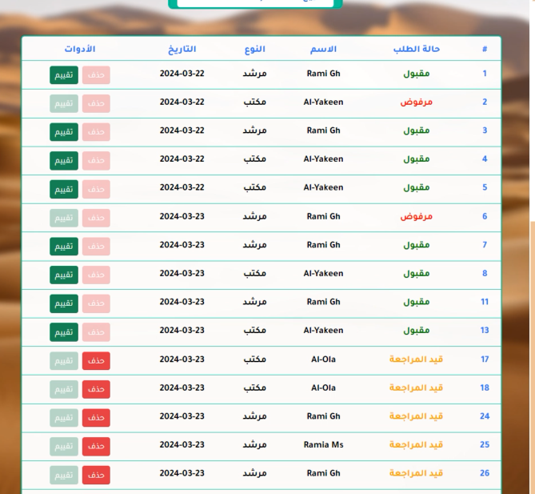

# Dalela

> **Dalela** is a comprehensive tourism platform built with **Laravel 10**, connecting **tourists**, **tour guides**, and **tourism agencies**.  
> It allows account registration, request management, ratings & reports submission, and provides an admin dashboard for system management.

---

## Screenshots

<div align="center">

  


  


</div>

---

## Table of Contents

-   [ Project Overview](#-project-overview)
-   [ Requirements](#-requirements)
-   [ Installation & Setup](#-installation--setup)
    -   [1. Clone the Repository](#1-clone-the-repository)
    -   [2. Install Dependencies](#2-install-dependencies)
    -   [3. Configure Environment](#3-configure-environment)
    -   [4. Set Up the Database](#4-set-up-the-database)
    -   [5. Run the Application](#5-run-the-application)
-   [ System Roles](#-system-roles)
-   [ Database Structure](#-database-structure)
-   [ Interfaces & Routes](#-interfaces--routes)
-   [ API Documentation](#-api-documentation)
-   [ Sample Credentials](#-sample-credentials)
-   [ Support & Contributions](#-support--contributions)
-   [ Acknowledgments](#-acknowledgments)

---

## Project Overview

Dalela is a **full-stack Laravel application** designed to:

-   Allow user **registration and authentication** for different roles
-   Enable browsing of **tour guides** and **tourism agencies**
-   Manage **user requests** and interactions
-   Allow **ratings and reviews** for guides and agencies
-   Allow users to submit **reports**
-   Provide an **admin dashboard** with role-based access control

---

## Tech Stack

-   **Framework (Backend):** Laravel 10.10
-   **Language (Backend):** PHP ^8.1
-   **Frontend:** HTML, CSS, JavaScript (Vanilla JS)
-   **Frontend Tooling:** Vite, Laravel Vite Plugin
-   **HTTP Client:** Axios
-   **Authentication:** Laravel Sanctum
-   **Database:** MySQL
-   **Package Manager:** Composer + NPM
-   **Testing:** PHPUnit / Mockery
-   **Code Style:** Laravel Pint

## Requirements

| Component | Version       |
| --------- | ------------- |
| PHP       | ≥ 8.1         |
| Composer  | Latest        |
| Laravel   | 10.x          |
| Database  | MySQL         |
| Node.js   | Latest (v18+) |

---

## Installation & Setup

## 1. Clone the Repository

git clone https://github.com/NourAlkinj/dalela.git
cd dalela

## 2. Install Dependencies

composer install # PHP dependencies
npm install # JS dependencies (if using frontend)

## 3. Configure Environment

cp .env.example .env
php artisan key:generate

## 4. Set Up the Database

php artisan migrate --seed

## 5. Run the Application

php artisan serve # Start Laravel dev server
npm run dev # Compile frontend assets if applicable

### System Roles

| Role               | Permissions                                     | Dashboard Route  |
| ------------------ | ----------------------------------------------- | ---------------- |
| **Admin**          | Full system access                              | `/admin`         |
| **Tour Guide**     | Manage own requests, view ratings               | `/tourGuide`     |
| **Tourism Agency** | Manage own requests, view ratings               | `/tourismAgency` |
| **User**           | Browse guides & agencies, submit requests, rate | `/user`          |

### Database Structure

| Table            | Columns                                            |
| ---------------- | -------------------------------------------------- |
| users            | id, name, email, password, user_type_id            |
| users_types      | id, name (e.g., User, TourGuide, Agency, Admin)    |
| tour_guides      | id, user_id, bio, phone, languages, rating         |
| tourism_agencies | id, user_id, agency_name, address, phone, rating   |
| requests         | id, user_id, guide_id / agency_id, status, details |
| rates            | id, user_id, guide_id / agency_id, rating, comment |
| reports          | id, user_id, target_id, type, description          |

### Interfaces & Routes

| Page                 | Route            | Description                                     |
| -------------------- | ---------------- | ----------------------------------------------- |
| Admin Dashboard      | `/admin`         | Manage all users, guides, agencies, and reports |
| Tour Guide Panel     | `/tourGuide`     | Manage own profile and requests                 |
| Tourism Agency Panel | `/tourismAgency` | Manage own profile and requests                 |
| User Panel           | `/user`          | Browse guides/agencies, manage requests         |

### API Documentation

## 1. Authentication

| Method | Endpoint                                    | Description         |
| ------ | ------------------------------------------- | ------------------- |
| POST   | `/api/user/register-user`                   | Register user       |
| POST   | `/api/user/login-user`                      | User login          |
| POST   | `/api/tourGuide/register-tourGuide`         | Register tour guide |
| POST   | `/api/tourGuide/login-tourGuide`            | Tour guide login    |
| POST   | `/api/tourismAgency/register-tourismAgency` | Register agency     |
| POST   | `/api/tourismAgency/login-tourismAgency`    | Agency login        |
| POST   | `/api/admin/register-admin`                 | Admin registration  |
| POST   | `/api/admin/login`                          | Admin login         |

## 2. Tour Guides & Agencies

| Method | Endpoint                                      | Description         |
| ------ | --------------------------------------------- | ------------------- |
| GET    | `/api/tourGuide/get-all-guides`               | List all guides     |
| GET    | `/api/tourGuide/get-guide/{id}`               | Get guide details   |
| GET    | `/api/tourGuide/get-guide-requests/{id}`      | Get guide requests  |
| GET    | `/api/tourGuide/get-guide-rates/{id}`         | Get guide ratings   |
| GET    | `/api/tourismAgency/get-all-agencies`         | List all agencies   |
| GET    | `/api/tourismAgency/get-agency/{id}`          | Get agency details  |
| GET    | `/api/tourismAgency/get-agency-requests/{id}` | Get agency requests |
| GET    | `/api/tourismAgency/get-agency-rates/{id}`    | Get agency ratings  |

## 3. Requests

| Method | Endpoint                             | Description           |
| ------ | ------------------------------------ | --------------------- |
| POST   | `/api/request/add-request `          | Add request           |
| POST   | `/api/request/update-request-status` | Update request status |
| GET    | `/api/request/cancel-request/{id}`   | Cancel request        |

## 4. Ratings

| Method | Endpoint             | Description |
| ------ | -------------------- | ----------- |
| POST   | `/api/rate/add-rate` | Add rating  |

## 5. Reports

| Method | Endpoint                 | Description |
| ------ | ------------------------ | ----------- |
| POST   | `/api/report/add-report` | Add report  |

## 6. Admin

| Method | Endpoint                        | Description      |
| ------ | ------------------------------- | ---------------- |
| GET    | `/api/admin/delete-guide/{id}`  | Delete guide     |
| GET    | `/api/admin/delete-agency/{id}` | Delete agency    |
| GET    | `/api/admin/get-all-reports`    | List all reports |

### Sample Responsesi

User Request Response

```json
{
  "id": 1,
  "user_id": 5,
  "guide_id": 2,
  "status": "pending",
  "details": "Request for city tour"
}
Rate Response
{
"id": 1,
"user_id": 5,
"guide_id": 2,
"rating": 5,
"comment": "Excellent guide!"
}

### Sample Credentials

## Admin

Email: admin@example.com
Password: 12345678

## Tour Guide

Email: guide@example.com
Password: 12345678

## Agency

Email: agency@example.com
Password: 12345678

## User

Email: user@example.com
Password: 12345678
```
